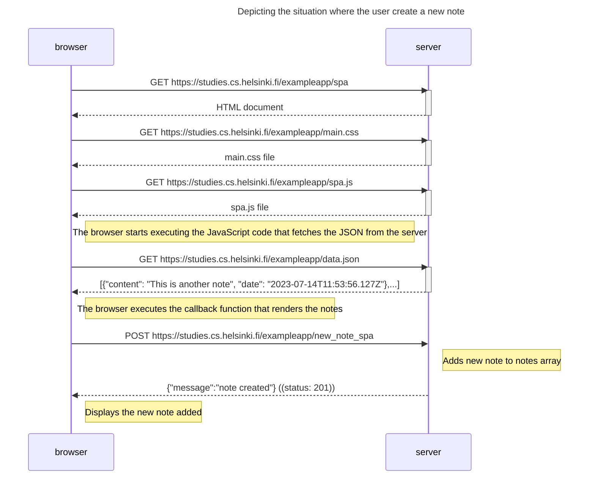

```mermaid    
sequenceDiagram
    
    title Depicting the situation where the user create a new note
    
    participant browser
    participant server
    
    browser->>server: GET https://studies.cs.helsinki.fi/exampleapp/spa
    activate server
    server-->>browser: HTML document
    deactivate server

    browser->>server: GET https://studies.cs.helsinki.fi/exampleapp/main.css
    activate server
    server-->>browser: main.css file
    deactivate server

    browser->>server: GET https://studies.cs.helsinki.fi/exampleapp/spa.js
    activate server
    server-->>browser: spa.js file
    deactivate server

    Note right of browser: The browser starts executing the JavaScript code that fetches the JSON from the server
    
    browser->>server: GET https://studies.cs.helsinki.fi/exampleapp/data.json
    activate server
    
    server-->>browser:[{"content": "This is another note", "date": "2023-07-14T11:53:56.127Z"},...]
    
    deactivate server

    Note right of browser: The browser executes the callback function that renders the notes
    
    browser->>server: POST https://studies.cs.helsinki.fi/exampleapp/new_note_spa
    
    Note right of server: Adds new note to notes array 
    
    server-->>browser: {"message":"note created"} ((status: 201))
    
    Note right of browser: Displays the new note added
```